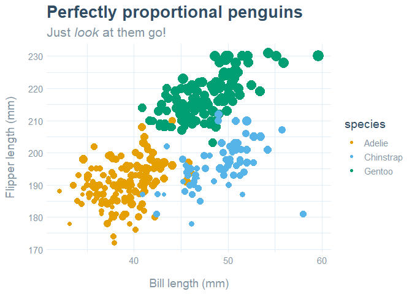
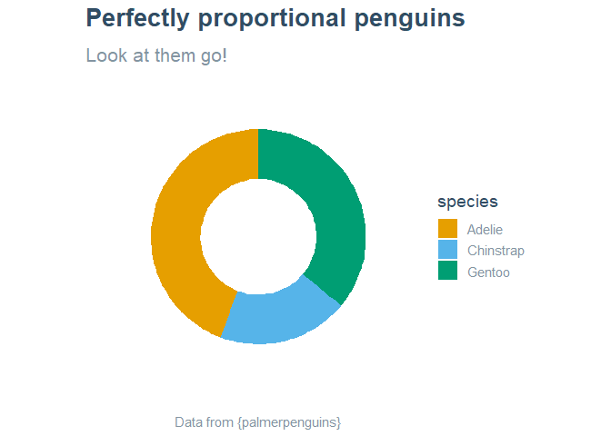

rfortherestofus
================

This is an internal package for R for the Rest of Us.

## Installation

Install with the `remotes` package:

    remotes::install_github("https://github.com/rfortherestofus/rfortherestofus")

## `rru_colors()` demo

The function returns a named vector of colors used in R for the Rest of
Us plots, and elsewhere. These are based on the website:

-   <span style="background-color: #6caadd; color: #FFFFFF;">**Blue -
    \#6caadd** </span>: the blue from the logo
-   <span style="background-color: #314D63; color:#FFFFFF;">**Dark
    Text - \#314D63** </span>: the dark blue text colour from the
    website
-   <span style="background-color:#8394A1; color: #FFFFFF;">**Light
    Text - \#8394A1** </span>: a lighter variant of the dark blue text
    color
-   <span style="background-color:#E1EEF8; color: #000000;">**Pale
    Blue - \#E1EEF8** </span>: a pale blue based on the logo blue, which
    is currently used for gridlines

``` r
rfortherestofus::rru_colors()
```

    ##       Blue  Dark Text Light Text  Pale Blue 
    ##  "#6caadd"  "#314D63"  "#8394A1"  "#E1EEF8"

``` r
rfortherestofus::rru_colors("Dark Text", "Pale Blue")
```

    ## [1] "#314D63" "#E1EEF8"

## `theme_rru()` demo

It uses the font “Inter”, which is available [via Google
Fonts](https://fonts.google.com/specimen/Inter?query=inter). Make sure
you install it on your device and import it into R before making use of
this theme.

``` r
library(tidyverse)

palmerpenguins::penguins %>%
  ggplot() +
  geom_point(aes(x = bill_length_mm,
                 y = flipper_length_mm,
                 color = species,
                 size = body_mass_g)) +
  labs(title = "Perfectly proportional penguins",
       subtitle = "Just *look* at them go!",
       x = "Bill length (mm)",
       y = "Flipper length (mm)") +
  colorblindr::scale_color_OkabeIto() +
  guides(size = "none") +
  rrutemplates::theme_rru()
```

<!-- -->

``` r
palmerpenguins::penguins %>%
  ggplot(aes(x = 1,
             fill = species),
         stat = "count") +
  geom_bar() +
  xlim(c(-0.5, 2)) +
  coord_polar(theta = "y") +
  labs(title = "Perfectly proportional penguins",
       subtitle = "Look at them go!",
       caption = "Data from {palmerpenguins}") +
  colorblindr::scale_fill_OkabeIto() +
  rrutemplates::theme_rru(void = TRUE) +
  theme(legend.position = "right",
        plot.caption = element_text(hjust = 0.5))
```

<!-- -->
